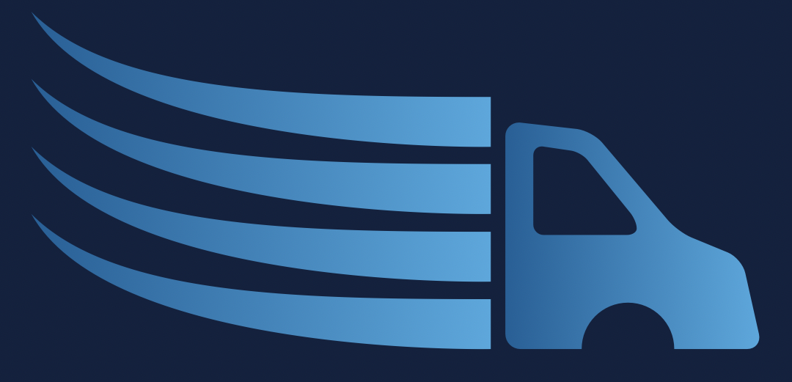

<h1 align='center'> Get Loads Now </h1>

<p align='center'>
    
  <br><br>
  <i> Load Board designed to
    <br> help transportation companies to find freights for free.</i>
  <br>
</p>

<p align='center'>
  <a href='https://getloadsnow.com/'><strong> Get Loads Now </strong></a>
  <br>
</p>

<br>

<div align='center'>


</div>

<div align='center'>


</div>

---

## Description

Welcome to Get Loads Now, the premier platform designed to streamline freight management for transportation companies of all sizes. Our intuitive Load Board empowers you to effortlessly find and secure freights without any cost, saving you time and resources.

Key Features:

 - **Free Access**: Enjoy unlimited access to our Load Board at absolutely no cost.
 - **User-Friendly Interface**: Our platform offers a simple and intuitive interface, making it easy for you to navigate and find the perfect freights.
 - **Comprehensive Listings**: Access a vast database of freight listings, ensuring you have plenty of options to choose from.
 - **Efficient Search**: Quickly filter and search for freights based on your specific criteria, allowing you to find the right loads with ease.
 - **Real-Time Updates**: Stay informed with real-time updates on available loads, ensuring you never miss out on any opportunities.
 - **Reliable Support**: Our dedicated support team is here to assist you with any questions or issues you may encounter.

## Table of Contents

- [Description](#description)
- [Table of Contents](#table-of-contents)
- [Installation](#installation)
  - [Cloning the Repository](#cloning-the-repository)
  - [Setting Up](#setting-up)
- [Mock-Up](#mock-up)
- [Usage](#usage)
- [Questions](#questions)
- [Contributing](#contributing)
  - [Contributing Guidelines](#contributing-guidelines)
  - [Code of Conduct](#code-of-conduct)
- [Credits](#credits)
  - [Authors](#authors)
  - [Acknowledgements](#acknowledgements)
- [License](#license)

## Installation

### Cloning the Repository

Click `<> code` - the green button. After clicking, in the local tab, copy the SSH key. Open the terminal in your Macbook or [git bash](https://git-scm.com/downloads), if you have Windows/Linux, and type:

```bash
git clone [paste ssh key]
```

### Setting Up

Open the project in [Visual Studio Code](https://code.visualstudio.com/download) and make sure you are in the directory of this application before installing the dependencies. To install it, type the commands below on your terminal:

```bash
npm i
```

Once you run this, npm will begin the installation process of all of the current project's dependencies.

## Mock-Up

The following animations and images shows the web application's appearance and functionality:

<div align='center'>


</div>

## Usage

Launch the application by entering the command below on your terminal:

```bash
npm run develop
```

Or access it through our oficial website [Get Loads Now](https://getloadsnow.com/)

## Questions

For questions and support feel free to contact us via:

**Larissa Guilherme**

<a href='mailto:larigens@gmail.com'>📧 Email </a>

**Anastasia Marvova**

<a href='mailto:anastasia19markova@gmail.com'>📧 Email </a>

## Contributing

### Contributing Guidelines

Want to report a bug, contribute some code, request a new feature, or improve the documentation? You can submit an issue and we will gladly review it, but before submitting an issue, please search the issue tracker, as it may already exist!

### Code of Conduct

Our Code of Conduct follows the same principles as the [Contributor Covenant](https://www.contributor-covenant.org/version/2/1/code_of_conduct/), version 2.1.

## Credits

### Author

👩🏻‍💻 **Larissa Guilherme**

[](https://github.com/larigens)
[](https://larigens.github.io/laricodes/)
[](https://www.linkedin.com/in/larigens/)


### Acknowledgements

- [W3 Schools](https://www.w3schools.com)
- [MDN](https://developer.mozilla.org/en-US/)
- [Node.js](https://nodejs.org/en/)
- [NPM](https://www.npmjs.com/)
- [Express.js](https://expressjs.com/en/4x/api.html)
- [Stack Overflow](https://stackoverflow.com/)
- [dotenv](https://www.npmjs.com/package/dotenv)
- [React](https://react.dev/learn)
- [Bootstrap](https://getbootstrap.com/docs/5.3/getting-started/introduction/)

## License

Please refer to the [LICENSE](https://choosealicense.com/licenses/apache-2.0/) in the repo.